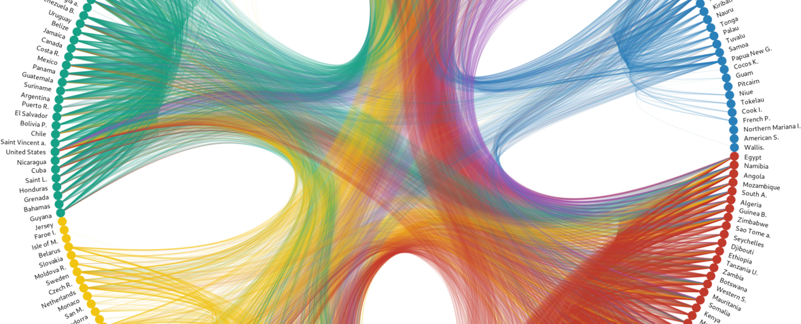

{{ site.subtitle }}

{{ site.lecture_type }}, {{ site.semester }}, {{ site.university }}

In this hands-on seminar, bachelor students of social and cultural sciences learn relevant technical skills and programming that they can incorporate into their everyday studies. Moreover, they develop an understanding of current developments in the field of information technology. This course aims to foster general digital literacy and to build a solid foundation for computational analysis, using Python and the command-line.

In this seminar, we focus on the computational processing of digital and digitized texts. A key point of scientific work is the systematic preparation and aggregation of data as well as the swift retrieval of relevant information. This task requires the handling of a wide variety of data forms, including data that is not yet structured in a tabular form. The seminar covers the full workflow from gathering textual data to analyze the content of an entire text collection to producing interactive visualizations. Sounds cool? It certainly is.

Along the road, we deal with questions like these:

* How can texts be quantitatively exploited to complement the qualitative content analysis?
* What are regular expressions, and why are they so powerful in the context of text analysis? 
* How to download data automatically from a website and process *en masse*? 
* How can historical texts be extracted from PDFs using Optical Character Recognition (OCR)?

[<i class="fas fa-external-link-alt"></i> Go to UniLu website](https://portal.unilu.ch/details?code=FS211368)

